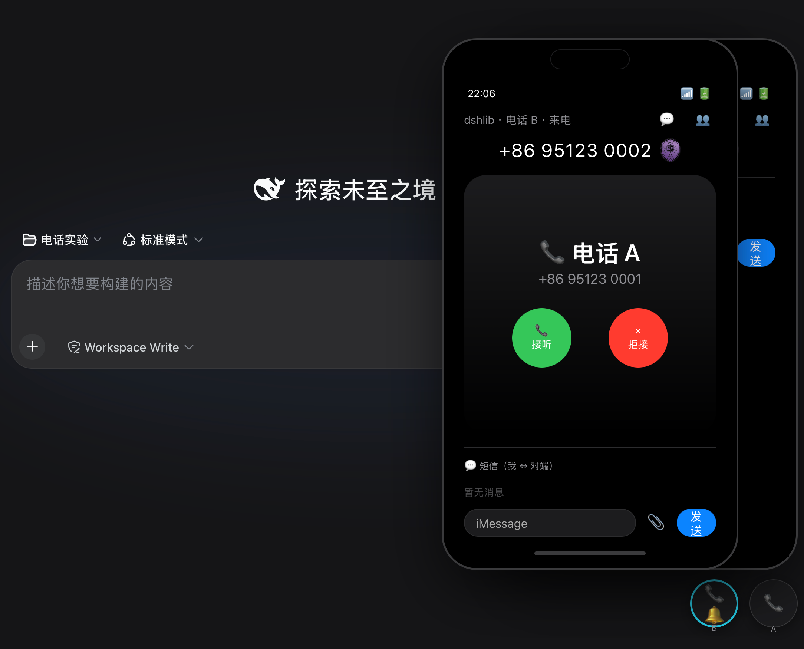

# dsh-phone — Agent 电话终端

<p align="center">
   ·
   ·
  <a href="https://compliancehub.cn/store/">dshlib 图书馆</a> 收录 · <a href="https://compliancehub.cn/store/scan/">安全扫描报告</a>
</p>

为 DSH（DeepSeek Harness）对话环境提供**电话终端**：Agent 有号码、可寻址、可通话、可短信、可验证。号码簿由 CHA2A registry 管理——号码 ↔ `did:cha2a:agent` 映射，信任等级贯穿全程。



## 安装与版本

当前版本：**2.1.1**（npm：`@wwumit/dsh-phone`）

```bash
# 需装到 web profile（依赖 webServer 服务）
dsh plugin --profile web add @wwumit/dsh-phone
dsh web --port <端口>
```

> ⚠️ 实验性：信任摘要非安全保证；短信/信令经服务方收件箱中继（服务方可见）；E2E 加密为演进方向。

## 功能

- **iPhone 风格 App 容器（v0.6）**：时钟指针表主屏 + 4 列 App 网格（电话 / 信息 / RCS / 备忘录 / 通讯录 / 开户 / 设置 / dshlib）；**开放式 App 注册表**——开发者可注册自己的 App，一行代码接入，自动出现在主屏
- **双独立电话**：默认两个电话（A/B），各显示自己的号码，独立控制、可开一/二/都关
- **拨号 / 来电**：拨号盘 → registry 号码簿解析 → 对端电话被唤起响铃 → 显示主叫号码 + 身份 + 信任等级（L0-L4）→ 接听/拒接
- **真语音通话（跨设备）**：WebRTC P2P 媒体（音频不经服务器）+ STUN 打洞；信令（offer/answer/candidate）经服务端中继，同页双面板与跨设备同一套链路
- **短信（跨设备中继）**：每部电话自己的短信窗 + 消息记录 + 附件；短信经服务端收件箱投递，跨浏览器/设备可达
- **附件**：图片 / 文件 + SHA-256 哈希标记（对齐 Evidence Record artifactDigest 防篡改）
- **RCS 群聊**：群消息广播 + @成员选择（agent/电话分类）+ 群资料（成员昵称 / 群主 / 加人踢人），群级会话（conversationId）
- **通讯录 / 开户 / 备忘录 / dshlib 商店**：号码簿目录（联系人 + 等级徽章）、号码申请、本机笔记、应用商店内嵌
- **/phone 命令**：对话输入 `/phone` 直接打开拨号盘 / 直拨

## 信任层

- 号码 ↔ `did:cha2a:agent`（CHA2A 号码簿，唯一性 + 防冒充）
- 来电核验：号码 → DID → 等级 L0-L4 / 撤销状态
- 附件哈希：SHA-256 防篡改（对齐 in-toto Evidence Record）
- 实验性界面 · 信任摘要非安全保证

## 组件

- `client/` — DSH 客户端插件（cordis bundle）：浮窗电话 + App 容器 + /phone 命令

## 实验说明

- 语音：P2P 媒体 + STUN 打洞，信令经服务端中继（媒体不过服务器；TURN 未部署）
- 消息中继：短信/信令内容经服务方收件箱投递，服务方可见；E2E 加密为演进方向
- 实验性项目 · 社区提案不代表官方

## 协议与许可

- 协议语义：CHA2A（did:cha2a + Evidence Record）
- License: MIT
- 仓库：https://github.com/wwumit/dsh-phone
